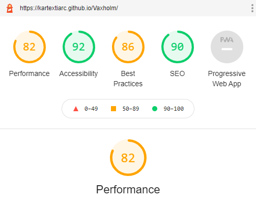
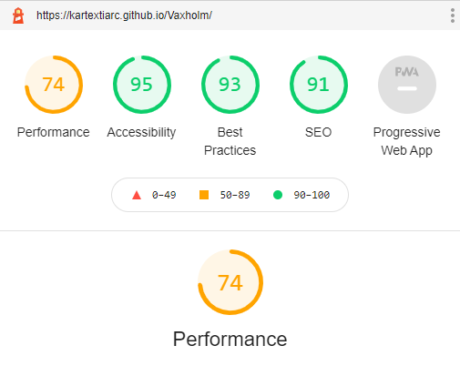

<h1 align="center">Welcome to Vaxholm</h1>

[Welcome to Vaxholm](https://kartextiarc.github.io/Vaxholm/)

[GitHub](https://github.com/KartexTiarc/Vaxholm)

## About

This is website created to people outside of Sweden to learn more of Vaxholm and come 
and visit. When the pandemic is over this is the perfect place to exlpore new vacation spot 
in the summer. A more nature environment to exlpore and much to learn about Sweden and what it got to 
offer. 

## User Experience (UX)

### User Stories

 ### When I am planning for the summer vacation I want a place that is not so much people when this pandemic is over.

* I want to easily understand the layout and finding what I seek without any instructions. 
* I want to be able to navigate through the site easily to find its content. 
* I want to easily get information what kind of activites one can do. 
* I want to be able to easily take contact with someone to get more information about the activites. 

### As a visitor that wants to start planning a vacation that is different. 

* I want to explore new environments that is not your usual vacation spot. 
* I want what can be offered. 
* I want to be able go through the content and find something that I want to do. 

### As a visitor that want to use the website on the fly.

* I want to be able to go to the website and show it to freinds and family.
* Easily to navigate when I on the move to explore the activites and easily can contact if needed.

### Design

 - ### Colours 

 - The colours was make it easy to read and be with. The page is mostly white for make it pronunce more of the content in it. 
 Dim gray (#666666) was used for the text color to make it more easy for the eyes to read. Its also make it not so pronunce. 
 The white (#ffffff) text for the jumbotron was used to catch the interest of the user to read more. The black (rgba(0, 0, 0, 0.3)) 
 for the jumbotron background was just for making the white text to stand out and not be overtaken by the background image. 
 The Air force blue (#597EAA) was used on the header and footer to connect that Vaxholm is close to the water and giving more of a warmth and 
 pleaseant theme. 

- ### Typography

- The first font that was used for the H classes and jumbo was Poppins for its style and not so decorated make it easy going feeling. 
- The second font was Lato that was used for the paragraphs on the site. Its for making it simple to read so much as possible for getting the information one wants 
about the activites. 

- ### Imagery 

- Images on this site serve three purposes. One is to emphasize the activites that one can do in Vaxholm. The other is to show what Vaxholm to offer to 
tourist and what more can be done. The third reaseon is to make people excited to travel on the vacation to Vaxholm to explore and hopefully enjoy their stay there. 

- ### Wireframes

- Wireframes was created using Balsamiq Wireframes, the layout and design did change during the process of the project and was updated. 
- [Wireframes](https://github.com/KartexTiarc/Vaxholm/blob/master/assets/MileStone%201%20project.pdf)

## Features

### Header

- The header shows in the left where you have come to. It is also a link to find ones way back.
- The navbar to the right is easy to find and its shows wich site you are on when you look at the navbar.
- The navbar for the mobile version collapse and shows very much where on the site one is. 
- The text Vaxholm is not to much on the mobile phone that make is not so much on the phone. 

### Links 

- Links have a underline to be able to see wich site one is. The links get lightblue when hovering over. 
- The social links let people be able to go direct to the relevant social sites for Vaxholm. 

### Images

- Gallerys modal make it easier to see one specifik picture make it easier to see the picture. 
- Smaller images in the content make a very good visiual for people to understand better what is written about.

### Background-Images

- The background images to show the beauty of the islands in Vaxholm and peek interrest. 

### Footer 

- Social links to offical site of Vaxholm city. 
- Make it easy for getting the right side for one interrested. 
- The bigger social links. 

### The Pages

- ### Home 
- Page is to introduce about Vaxholm.
- The first background image is showing Vaxholm city.
- The information about what can do is short and good. 

- ### Activity 
- Another background image for show of the nature.
- More specifik about the activites one can do in Vaxholm.
- Still short for peeking the interest. 

- ### Gallery
- Show many different aspect of Vaxholm.
- Not to many or to few to show what can give. 

- ### Contact 
- A form to make it easy for one take contact for anyone who get interrested.

## Technologies used

### Languages used

- HTML5
- CSS3 
- Javascript (through bootstrap)

### Frameworks and programs used

- Bootstrap v5.0.0-beta1 - Used Javascript through Bootstrap and the navbar, footer header and the content using the grid system and media.
- Git hub - For mine repositories and my code with my website site is located there. 
- GitPod - The site I used for coding the entire site. 
- Google Fonts - Used Google Fonts to import the font-family for my site. 
- Font Awesome - The images used for social links was imported from Font Awesome. 
- Balsamiq Wireframes - Balsamiq was used to do the Frameworks.

## Testing

### Functionality Testing

- ### Navigation bar 
- Testing with both mobile and desktop.
- The Functionality worked very well both. 

### CSS3 Validator 

- Passed

### HTML5 Validator

- Home page - Pass
- Acitivty page - Pass 
- Gallery page - Pass
- Contact page - Pass

### Compatibility Testing

- Browser Compatibility 

- Testing on Chrome mobile and desktop - Pass
- Testing on safari mobile and desktop - Pass

### Performance Testing

- Lighthouse Testing
- Testing on desktop
 

 - Test on mobile
 

#### Testing User Stories

 #### When I am planning for the summer vacation I want a place that is not so much people when this pandemic is over.

* I want to easily understand the layout and finding what I seek without any instructions. 
1. The first page introduce the user to what kind of page it is. 
* I want to be able to navigate through the site easily to find its content.
1. The content on the first page is easily understod and with a fixed header make it easy to navigate the site. 
* I want to easily get information what kind of activites one can do. 
1. The information is comprimise to make it easy to understand with very different activites. 
* I want to be able to easily take contact with someone to get more information about the activites. 
1. The header make it easy to take contact and give the ability to contact and ask what kind of activites one seeks. 

#### As a visitor that wants to start planning a vacation that is different. 

* I want to explore new environments that is not your usual vacation spot. 
1. Vaxholm is not know so much about that makes it perfect vacation spot. 
* I want to know what can be offered. 
1. There is a lot of activites in Vaxholm to offer. If there is some queistions it can easily be asked. 
* I want to be able go through the content and find something that I want to do. 
1. The content on the site is not all that can offer and through the contact page one can asked what else can be offered. 

#### As a visitor that want to use the website on the fly.

* I want to be able to go to the website and show it to freinds and family.
1. The site is adjusted to be seen on desktop and mobile. It is very user freindly on mobile devices. 
* Easily to navigate when I on the move to explore the activites and easily can contact if needed.
1. The mobile page make it very good to have on the move. 

## Deployment

### Publishing

This site was publiched with [GitHub Pages](https://pages.github.com/). How to create a GitHub page is below. 

1. Go to the GitHub website and create a log in. 
2. On the left you will see your repositories (if you have created one), select the one you want to set up a page for. 
3. Above the repositories you will see a menu. To the right you will find one that say "Settings". 
4. Then go down to GitHub pages.
5. Choose master as source and then you click save. 

## Known Bugs

There are no known bugs at the moment. 

## Credits
 
### Code

- Bootstrap library was used to create the modal, responsive design, navbar, form, footer, header and image carousel elements. 
- The code for the modal was created by [Diego Vogel](https://css-tricks.com/creating-a-modal-image-gallery-with-bootstrap-components/) on [CSS-Tricks](https://css-tricks.com/).

### Content

- All the code was written by - Christoffer Nyh.
- To get the right colour schemes Balsamiq Wireframes was used. 
- The README file was formed after the Code Institute Sample Read. 

### Media 

- Three pictures was used from [Unsplash](https://unsplash.com/)
1. First picture of Kayaking in the sun was taken by [Pete Nowicki](https://unsplash.com/photos/8G_VvJrYKkE).
2. Second picture of Hiking in the woods was taken by [Jake Melara](https://unsplash.com/photos/Yh6K2eTr_FY).
3. Third picture of Camping was taken by [Esther Tuttle](https://unsplash.com/photos/dyjH3YMblpo).

- The other picture was taken by the author of the code Christoffer Nyh.

### Acknowledgements

- I saw the need for a english oriented site for Vaxholm to gain tourist in the future when pandemic is over.
- Thanks to evryone that gave me advice and feedback about my page. 
